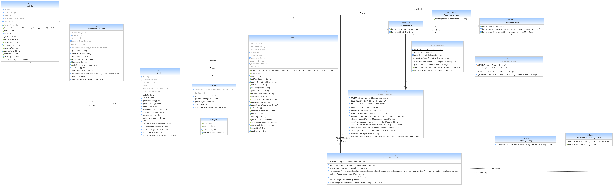

## Drive Project

### Completed User Stories

As a customer, I can create a customer account to place an order.

As a customer, I can order items.

As a customer, I can file a complaint.

As an admin, I can respond to a complaint and close a request.

As an admin, I can "ban" a customer account.

### UML Diagram



### Strengths

- Customers' sensitive data are encoded to ensure data security.
- Routes are secured to prevent potential security vulnerabilities in the application.
- The application respect restful conventions.
- Use of a token that avoids the use of cookies and thus secures the application.
- The complaint interface adheres to fundamental HCI principles, making it ergonomic.
- The administration panel has the ability to filter users, allowing for more efficient management.

### Project Deployment

To build a .war archive, use the following command:

```
mvn package war:exploded
```

A **.war** will be generated in the **target** directory at the root of the project.

To add the context to a Tomcat server, go to the **conf** directory of Tomcat and add the following line to the server.xml file:

```
<Context docBase="{chemin absolu de l'archive .war}" 
    path="drive" 
    reloadable="true" 
/>
```

Then run the following command:

For Linux:

```
./catalina.sh run
```

For Windows:
```
./catalina.bat run
```

A .war archive is available at the root of the project.

### Project Link

Once Tomcat is running, please go to http://localhost:8080/drive/init.html to initialize the database.